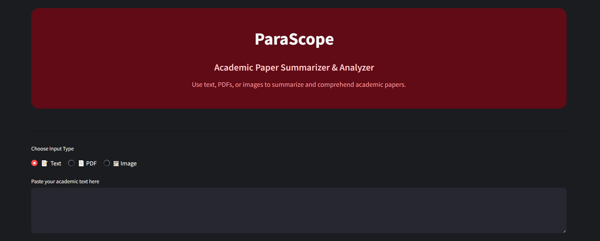
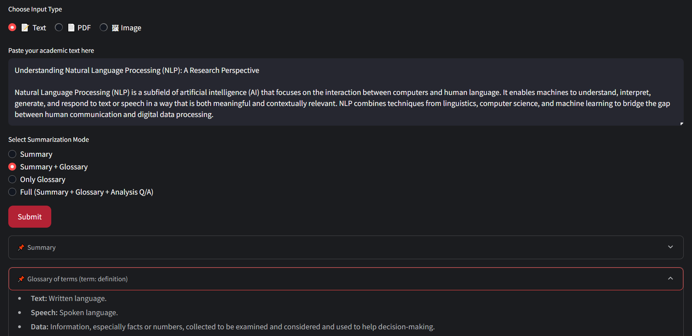
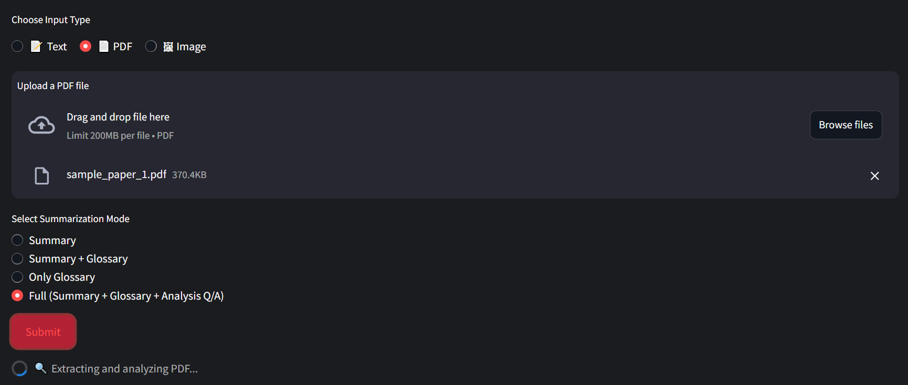
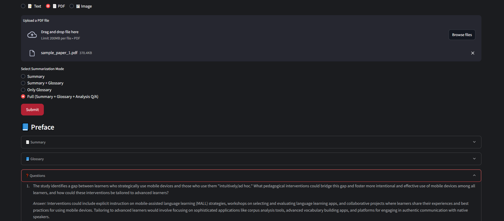

.venv\Scripts\activate   # Activate virtual environment
cd academic_summarizer
streamlit run main.py    # Run your Streamlit app

# ParaScope – Academic Paper Summarizer & Explainer

**ParaScope** is a multi-modal academic assistant that simplifies dense research papers, scanned notes, and technical PDFs using state-of-the-art AI. It supports academic comprehension by generating summaries, glossaries, and question-answer pairs.


## Features

- **Multi-format Input Modes**
  - Paste academic text
  - Upload PDF files (auto-splits and summarizes section-wise)
  - Upload scanned images (OCR-based extraction & cleanup)

- **AI-Powered Summarization**
  - Summary only
  - Summary + Glossary
  - Glossary only
  - Full Analysis (Summary + Glossary + QnA)

- **Built-in Smart Assistant**
  - Auto-generates comprehension questions
  - Explain terms in simpler language
  - Suggest key sections for further reading

- **Error Handling**
  - Detects empty input, invalid PDFs, and low-confidence OCR
  - Provides visual warnings and fallback messages


## Tech Stack

- **Frontend**: Streamlit 
- **Backend**: Python, pdfplumber, PyMuPDF, Pillow (OCR), Regex
- **AI Services**: Google Gemini Pro, Gemini Vision (via API)
- **Utilities**: Session state, Prompt templates, Dynamic chunking


## Getting Started

```bash
# 1. Activate virtual environment
.venv\Scripts\activate

# 2. Move into the project directory
cd academic_summarizer

# 3. Run the Streamlit application
streamlit run main.py
```


## Screenshots

1. **Home Page** – Haero section and the radio input options to choose from - Text / PDF / Image.

2. **Text Mode** – Text option chosen and the glossary section is expanded.

3. **Loading Spinner in Action** – During PDF processing, the loading message that is shown

4. **PDF Mode** – this gives the output With section/chunk wise summaries and others.

5. **Image Mode** – analysis the text and then gives what is asked, here in image quality is low, it lets you know that.


## Project Structure

academic_summarizer/
│
├── app/ # Summarization + Prompt logic
├── inputs/ # Text, PDF, and Image input processing
├── utils/ # Cleaners, validators, helpers
├── frontend/ # Streamlit layout and UI logic
├── data/ # Sample inputs (PDFs, Images)
├── main.py # Streamlit entry point
├── config.py # API keys & global config
├── requirements.txt
└── README.md


## Getting Started

### 1. Clone the Repository

```bash
git clone https://github.com/your-username/academic_summarizer.git
cd academic_summarizer
```

### 2. Setup Environment (Windows)

```bash
python -m venv .venv
.venv\\Scripts\\activate
pip install -r requirements.txt
```

### 3. Run the App
```bash
cd academic_summarizer
streamlit run main.py
```

### 4. Gemini API Setup
To use the app, you need a Google Gemini API key, for that you have to create a config.py file in the root folder:
```bash
# config.py
GEMINI_API_KEY = "your-key-here"
Then, you're good to go!
```

## Future Work

- Add export to `.pdf` support  
- Enable chat assistant with memory for follow-up queries  
- Add support for multilingual documents  


Made by Abhishek Karthik - CSE (AIML)